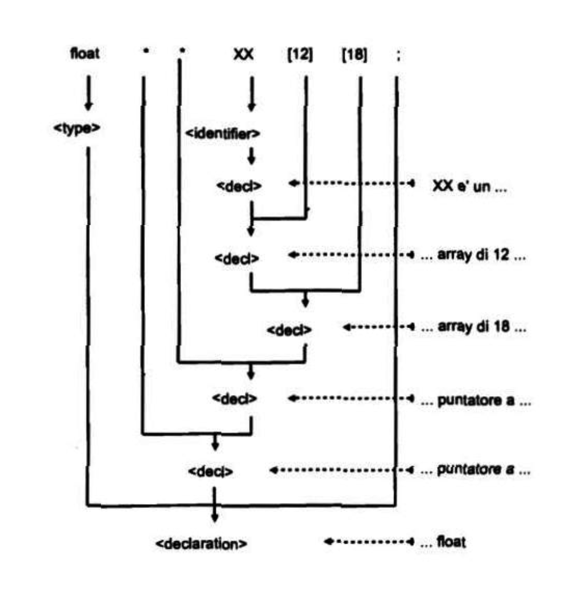

# Fondamenti di Informatica


---

09/10/25

## Espressioni

``` bnf
<expr> ::= <var> | <const> | <var> ++ | ++ <var> | <var> -- | -- <var> |
```

### Gli unici operatori che fanno side-effect su una variabile sono

1. incremento ++
2. decremento --
3. assegnazione =

``` bnf
<var> = <expr> | <expr1><op2><expr2> | <op1><expr1>
```

### Gli operatori binari

### Aritmetici

``` bnf
<op2> ::= + | - | * | / | %
```

Operazioni fra int

``` c
int a;
int b;
int c;

a = 10;
b = 4;

c = a/b; //c sarà 2, perché si lavora fra interi
```

Operazioni fra int ma c float

``` c
int a;
int b;
float c;

a = 10;
b = 4;

c = a/b; //c sarà 2, perché si lavora fra interi anche se c è float
```

Operazioni fra int e float

``` c
int a;
float b;
int c;

a = 10;
b = 4;

c = a/b; //Operazione eseguita fra float (tipo più forte) ma c resta 2, viene troncata la parte decimale
```

Operazioni fra int e float con c float

``` c
int a;
float b;
float c;

a = 10;
b = 4;

c = a/b; //c sarà 2.5, dato che float prevale su int e c è comunque float
```

Forza dei tipi di dato

``` html2
int < float < double
short < int < long
unsigned < int
```

---

### Relazionali

``` bnf
<op2> ::= < | <= | == | != | >= | >
```

in c non abbiamo il booleano, il risultato dell'applicazione di un operatore relazionale è 1 per vero e 0 per falso.

``` c
int a;
int b;
int c;

a = 10;
b = 5;

c = a>b; //c sarà 1 (true)
```

---

### Logici

``` bnf
<op2> ::= && /*And*/ | || /*Or*/ | ! /*Not*/
```

in C un valore =! da 0 è vero
e un valore == 0 è falso

Il risultato è sempre booleano

``` c
int a;
int b;
int c;

c = !3.2 /*vero =! da 0*/; //c è 0, falso (dato che ha il ! davanti)

a = 7;
b = 5;
c = a > b &&! a; //a > b è vero
```

### Op logico &&

viene eseguita expr1 e vengono applicati i suoi side-effect (se presenti).
Se il valore restituito da expr 1 è vero (=! da 0) allora è eseguita anche expr2. Altrimenti se expr1 è falsa, expr2 non è eseguita. Assimmetria nota come "short circuit".

``` c
int a;
int b;
int c;

a = 6;
b = 3;

c = a < b && a++; //Se a <! di b non viene eseguita a++.
```

### Op logico ||

viene eseguita expr1 e sono applicati i suoi side-effect (se presenti). Se il valore restituito da expr1 è vero (=! 0) expr2 non viene eseguita (il risultato dell'Or è comunque vero).

---

### Bit-a-bit

``` bnf
<op2> & | | | << | >> | ^
```

 and &, or |, shift left << | shift right >> | xor ^ | not ~

### Gli operatori unari

``` bnf
<op1> ::= ! /*Not logico */ | ~ /*Negazione bit-a-bit/*
```

## Semantica

``` bnf
. Γ(<expr1><op2><expr2>) = Γ(<expr1>) <op2> Γ(expr2)
```

---

16/10/25

## Puntatori

sono degli interi a 32 bit, posso puntare a int, float ma anche void.

``` bnf
<declaration> ::= <type><decl>
<decl> ::= <identifier> | * <decl>
```

``` c
int * ptr; //Var puntatore
int ** ptr2 //Vuole indirizzo di un puntatore
```

### Uso dei puntatori

Sul puntatore è possibile fare l'operazione di **dereferenziazione**

Mi permette di usare un puntatore per accedere ad una variabile nella memoria.

``` bnf
<var> ::= <identifier> | (<var>) | *<expr> //Espressione che restituisce un indirizzo
```

### Operatore indirizzo

Assegnare ad un puntatore un'altra variabile.

``` bnf
<expr> ::= ... | &<var>
```

``` c
int a;
int *ptr:

ptr = &a; //Assegno a ptr l'indirizzo di a
```


Esempio:

``` c
void *ptr;
int m:
int n;

float x;
float y;

int select;

if(select)
{
    ptr = &m; //Assegno indirizzo var m
}
else
{ 
    ptr = &x //Assegno indirizzo var x
} 

//Il tipo non è importante

if(select)
{//n = m
    n = *((int*)ptr);
}
else
{ //y = x
    y = *((float*)ptr);
}

//Il tipo conta
```

* (int*) cast del puntatore. Puntatore a void è trasformato in puntatore a int.

* *dereferenzia l'indirzzo di una var intera.

### Cast di un puntatore

``` bnf
<expr> ::= ... | (<cast_type>) <expr>
<cast_type> ::= <type> | <cast_type>*
```

Rendere (int*) legale nella nostra grammatica.

---

## Array

Un array è un insieme di variabili dello stesso tipo.

* le variabili hanno lo stesso nome.
* sono indicate dal nome collettivo e un indice numerico.

Le variabili che compongono l'insieme sono allocate in posizioni contigue della memoria.

### Dichiarazione

``` bnf
<declaration> ::= <type><decl>;
<decl> ::= <identifier> | *<decl> | <decl>[<const>]
```

``` c
int V[10]; //V è un array di 10 variabili di tipo int

float X[15]; //X è un array di 15 variabili float

int A[5][3]; //A è un array di 5 array di 3 variabili int, A matrice 5x3
```

---

### Array semplice


---

### Array complesso


---

### Albero sintattico



Esempio
(occupa 24 byte in memoria) 3 x 4 B x 2

``` c
float **Z[3][2]; // Z è un array di 3 array di 2
//Doppi puntatori a float
```

``` bnf
<decl> ::= ... | (<decl>)
```

---

### Riferimento alle variabili di un array

``` bnf
<var> ::= ... | <expr1> [<expr2>]
```

è equivalente alla seguente scrittura *(expr1 + expr2) aritmetica dei puntatori.

* expr1 restituisce un indirizzo
* expr2 restituisce un intero

il nome di un array se usato in una espressione restituisce il valore l'indirizzo di inizio in memoria dell'array.

* expr1 può essere il nome dell'array


Puntatore ad un array

---

### Array multidimensionale

Per risolvere problemi con matrici

Esempio: Calcolo del prodotto fra A e B


formano una matrice C 3x4.

Proviamo con il codice

``` c
int A[3][2];
int B[2][4];
int C[3][4];

int i; //Indice riga
int j; //Indice colonna
int k; //k per sommatoria

for(i = 0; i < 3; i++)
{
    for(j = 0; j < 4; j++)
    {
        C[i][j] = 0;

        for(k = 0; k < 2; k++)
        {
            C[i][j] += A[i][k] * B[k][j];
        }
    }
}

//Stampa C
```

---

20/10/25

## Grammatica delle istruzioni

Dirigono il flusso di esecuzione

``` bnf
<statement> ::= <expr>; | <statement1><statement2> | {statement} //Graffe del C (compound)
```

### Semantica istruzioni

Viene eseguita l'espressione ed i suoi eventuali side-effects spmp applicati. Il **controllo** del **flusso** è trasferito all'istruzione successiva.

### Istruzione condizionale

``` c
if(expr_guardia)
{
    //Ti puzza l'ano
}
else
{
    //Ti puzza il culo
}
```

2 casi:

* solo if (solo una condizione)

``` bnf
<statement> ::= ... | if(<expr_guardia>)<statement>
```

* anche else

``` bnf
<statement> ::= ... | if(<expr_guardia>)<statement1> else<statement2>
```

Viene calcolata l'espressione di guardia se è vera (diverso da 0) viene eseguito:

``` bnf
<statement1>
```

altrimenti se presente else viene eseguita

``` bnf
<statement2>
```

### Istruzioni iterative

``` bnf
<statement> ::= ... | for(<expr_int>; <expr_guard>; <expr_inc>)<statement> | while(<expr_guard>)<statement> | do(<statement>) while(<expr_guard>)
```

### for()

### Semantica for

Viene eseguita l'espressione di inizializzazione (expr_int) viene eseguita l'espressione di guardia se l'espressione di guardia è **vera** (≠ 0) allora è eseguito lo statement1 e a seguire l'espressione di incremento. Il controllo del flusso è poi ritornato all'espressione di guardia. Se l'espressione di guardia è falsa (== 0) il controllo è trasferito all'istruzione che segue statement1.

---

23/10/25

### Istruzione di salto

``` bnf
<statement> ::= goto <label>; | break; | continue; | switch(<expr>){
    {case <const>: <statement>}
    [default: <statement>]
} | return[<expr>];
```

### goto

* **goto** permette di trasferire incondizionatamente il flusso di esecuzione del programma a un'altra istruzione, identificata da un'etichetta. Sebbene sia una funzionalità del linguaggio, il suo uso è fortemente sconsigliato dalla comunità dei programmatori.

```c
// ... codice
if (condizione) {
    goto etichetta;
}
// ... codice che viene saltato
etichetta:
// ... codice che viene eseguito dopo il salto
```

---

### break

* **break** serve per uscire immediatamente da un ciclo (for, while, do-while) o da un'istruzione switch. Quando l'esecuzione del programma incontra un break, il controllo viene trasferito alla prima istruzione che segue il blocco di codice in cui si trova il break

---

### continue

* L'istruzione **continue** nel linguaggio C serve a saltare l'iterazione corrente di un ciclo e passare immediatamente a quella successiva. A differenza dell'istruzione break, che termina l'intero ciclo, continue interrompe solo l'esecuzione del blocco di codice rimanente nell'iterazione in corso e riprende con l'iterazione successiva.

---

### switch

* **switch** L'istruzione switch nel linguaggio C è una struttura di controllo che permette di eseguire diversi blocchi di codice in base al valore di una singola variabile o espressione. È un'alternativa più leggibile e pulita a una lunga serie di istruzioni if-else if.

```c
switch (espressione) {
    case valore1:
        // blocco di codice da eseguire se l'espressione è uguale a valore1
        break;
    case valore2:
        // blocco di codice da eseguire se l'espressione è uguale a valore2
        break;
    // ... altri case ...
    default:
        // blocco di codice da eseguire se nessun case corrisponde
}
```

## Funzioni

è un costrutto di controllo del flusso di esecuzione.
È una sorta di **goto** con ritorno. Trasferisce il controllo del flusso di esecuzione ad un frammento di codice e lo riottiene indietro al termine dell'esecuzione.

L'uso delle funzioni offre diversi vantaggi:

* Modularità: Permette di suddividere un programma complesso in parti più piccole e gestibili.

* Riutilizzo del codice: Consente di scrivere un blocco di codice una sola volta e di richiamarlo più volte.

* Chiarezza: Rende il codice più leggibile e facile da capire, in quanto ogni funzione ha un nome che ne descrive lo scopo.


```c
// 1. Prototipo della funzione
// Dichiara una funzione che accetta due interi e restituisce un intero.
int somma_numeri(int a, int b);

int main() {
    int risultato;
    int numero1 = 10;
    int numero2 = 5;

    // 3. Chiamata alla funzione
    risultato = somma_numeri(numero1, numero2);

    printf("La somma è: %d\n", risultato);
    return 0;
}

// 2. Definizione della funzione
// Implementa il codice per sommare due interi.
int somma_numeri(int a, int b) {
    int somma;
    somma = a + b;
    return somma;
}
```

---

30/10/25

## Grammatica del C

```bnf
<program>::= { <declaration> | <function_definition> | <directive> | typedef <type> <identifier>; }
```

* In linguaggio C, la parola chiave typedef (abbreviazione di "type definition", in italiano "definizione di tipo") serve a creare un sinonimo o un alias per un tipo di dato già esistente. L'obiettivo principale è rendere il codice più leggibile, portabile e semplice da gestire.

```c
typedef unsigned short int boolean;
boolean a;
```

typedef può essere usato per dare un nome più significativo a un tipo di dato base, come int, char o float

Esempi:

```c
#define TRUE 1
#define FALSE 0

typedef unsigned short int boolean;

int main()
{
    boolean a;
    a = TRUE;
}
```

## Nota sulle funzioni

### Variabili statiche

Sono variabili dichiarate all'interno delle funzioni (modificatore **static**). Sono inizializzate una sola volta e mantengono il loro valore nelle chiamate successive.
Allocate nel segmento dati **non** nello stack

```c
void f(int a)
{
    static int count;
    count = 0;

    count ++;
    //Conta quante volte viene chiamata la funzione
}
```

---

## Dati strutturati

Un dato strutturato è un insieme di variabili anche di tipo **diverso** a cui è possibile far riferimento attraverso un **nome collettivo** ed un indice **simbolico**. Le variabili possono essere allocate in posizioni di memoria non contigue.

### Grammatica

* definizione

* dichiarazione

* riferimento

### Definizione

```bnf
<struct_definition> ::= struct <identifier> {{<type><decl>;}};
```

```c
struct Point
{
    float x;
    float y;
};
```

### Dichiarazione

```bnf
<type> ::= ... | struct <identifier>
```

```c
struct Point pt1; //Dichiare una va di tipo struct Point
struct Point pt2;
struct Point points[10]; //Array di tipo struct Point
struct Point *ptr; //Puntatore ad una var struct Point
```

posso pure:

```c
typedef struct Point Punto; //Punto è un alias per struct Point
```

### Riferimento/Uso

```c
struct Persona 
{
    char nome[50];
    int eta;
    float stipendio;
} persona1, persona2;

persona1.eta = 30;
printf("Età: %d\n", persona1.eta);
```


---

## Esercizi

### (es) riferimento a variabile

```c
(A[count].ptr) -> codice
```

### Definizioni e definizioni

```c
struct record 
{
    struct noninativo *ptr;
};

struct nominativo
{
    int codice;
};
```

```c
struct record A[128];
int count;
```

### Quesiti

* correttezza sintattica con albero sint.

* semantica.

* produzioni della grammatica coinvolte.

### Albero sintattico ex

